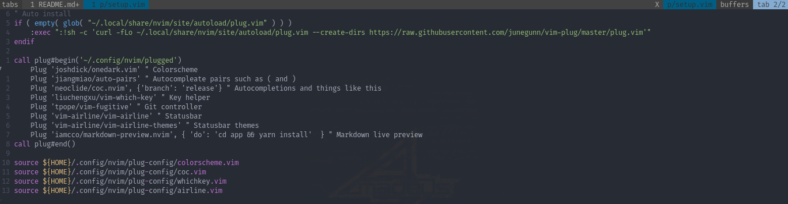

# Neovim

Neovim is a text editor, currently my favorite. My configs are not much complex

## Keybindings

The leader key is space

* **\<leader\>** + **q**
  * Quit if there's nothing to save
* **\<leader\>** + **\<leader\>**
  * Save the changes
* **\<leader\>** + **r**
  * Reload the configurations
* **\<leader\>** + **i**
  * Install/update the plugins
* **t** + **n**
  * Create a new tab
* **t** + **k**
  * Go to the next tab
* **t** + **j**
  * Go to the previous tab
* **t** + **h**
  * Go to the first tab
* **t** + **l**
  * Go to the last tab
* **t** + **"**
  * Split window horizontally
* **t** + **%**
  * Split window vertically
* **t** + **\<Left\>**
  * Add 3 of vertical size from the current tab
* **t** + **\<Right\>**
  * Remove 3 of vertical size from the current tab
* **t** + **\<Up\>**
  * Add 3 of horizontal size from the current tab
* **t** + **\<Down\>**
  * Remove 3 of horizontal size from the current tab

## Plugins

### Onedark

Onedark is currently my colorscheme

[joshdick/onedark.vim](https://github.com/joshdick/onedark.vim)

### Auto-pairs

Auto-pairs is a plugin I've been using for a while, it helps a lot because it
automatically complete chars that are usually written in pairs

[jiangmiao/auto-pairs](https://github.com/jiangmiao/auto-pairs)

### Coc

Coc is one of the plugins that I would most miss if I couldn't get my configs.
What is does is to bring some IDE's habilities to vim (neovim in my case),
autocompletion is what I'm talking about

[neoclide/coc.nvim](https://github.com/neoclide/coc.nvim)

### vim-which-key

This plugin is to help remembering the keybindings, it will pop-up a screen with
possibilities after pressing the leader key

[liuchengxu/vim-which-key](https://github.com/liuchengxu/vim-which-key)

### Vim-fugitive

To be honest I don't have configured this one properly yet, but from what I've
heard it provides integrations with git, I know it'll be very usefull

[tpope/vim-fugitive](https://github.com/tpope/vim-fugitive)

### Lightline

Lightline is a bottom line plugin, mainly used to prettify the editor

[itchyny/lightline.vim](https://github.com/itchyny/lightline.vim)

### Markdown-preview

This plugin is used to write markdown and see it, through a web browser

[iamcco/markdown-preview.nvim](https://github.com/iamcco/markdown-preview.nvim)
