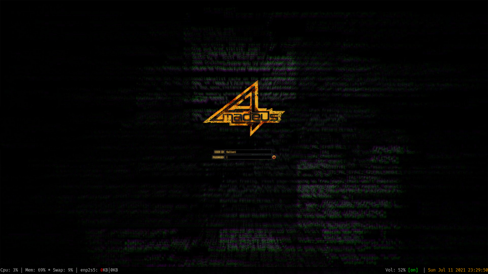

# Xmonad

Xmonad is a tiling window manager, it is compiled and configured using the
haskel language. My configurations includes:
* App launcher ( \<alt\> + p )
  * I use dmenu as a customized app launcher
* Emoji picker ( \<alt\> + \<shift\> +
p )
  * I use dmenu as an emoji picker
    * As a dependency a file with emojis must be at
    _/usr/share/consts/emojis.txt_
* XKiller ( \<alt\> + \<shift\> +
x )
  * An alias to x kill
* Xmobar switch ( \<alt\> + b )
  * Turn on or off xmobar
* Full screen screenshot ( \<print\>
 )
  * Take a print of the entire screen
* Partial screen screenshot ( \<shift\>
\<print\> )
  * Take a print of the selected portion of the screen

The visual is actually pretty default, but here is a screenshot (I use nitrogen
to manage the wallpaper)

